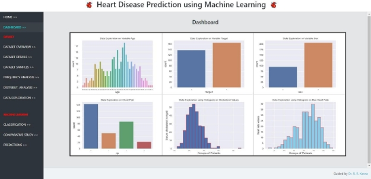
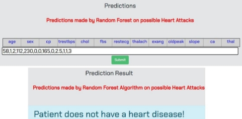
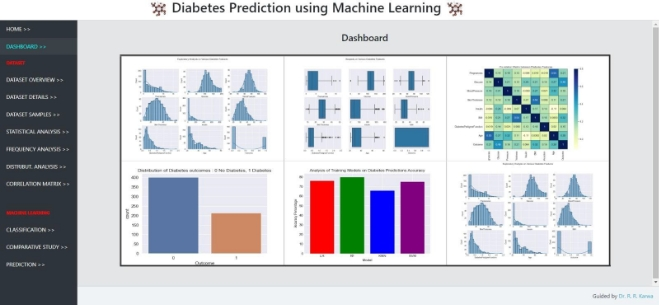
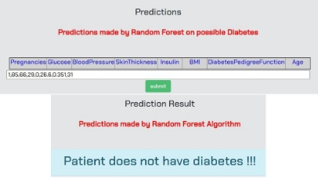
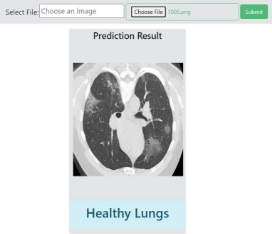

# **Project Title**: *ANALYSIS AND PREDICTION OF COMMON HEALTH   ISSUES USING MACHINE LEARNING*

# **Project Description**:-
### This project uses machine learning techniques to predict and analyze common health issues such as heart attack, diabetes, and lung cancer. The team analyzed respective datasets and trained machine learning models to provide accurate predictions. The goal of the project is to assist medical practitioners and diagnostic centers in accurate disease prediction. Users can input attribute values for heart and diabetes disease predictions, and upload lung images in JPEG or PNG format for lung cancer prediction. This project has the potential to improve healthcare outcomes and contribute to a better quality of life for patients.
  
# **Data Collection/Datasets:--**  
*The dataset used for this project is available at*

***Heart Disease Dataset: [link](https://archive-beta.ics.uci.edu/dataset/45/heart+disease) 	Format: CSV***

***Diabetes PIMA Dataset: [link](https://www.kaggle.com/datasets/uciml/pima-indians-diabetes-database) 	Format: CSV***

***Lung Cancer Dataset: [link](https://doi.org/10.7937/K9/TCIA.2015.LO9QL9SX) 	               Format: DICOM***

<font color="red"> NOTE:</font> The Lung Cancer dataset available at <https://doi.org/10.7937/K9/TCIA.2015.LO9QL9SX> is in the DICOM (Digital Imaging and Communications in Medicine) format. DICOM is a standard format used for medical imaging data, such as CT scans and MRI images. It includes metadata and image data, and is widely used in the medical industry for sharing and storing medical imaging data.

Converting DICOM images to JPG or PNG format requires a conversion tool. Here's an example of how you could convert DICOM images in Python using the pydicom library: 
```python
import os
import pydicom
from PIL import Image

input_folder = "/path/to/dicom/images/"
output_folder = "/path/to/output/images/"

# Loop through all files in the input folder
for filename in os.listdir(input_folder):
    # Read the DICOM file
    ds = pydicom.dcmread(os.path.join(input_folder, filename))

    # Convert to a PIL Image object
    image = Image.fromarray(ds.pixel_array)

    # Save the image in JPEG format
    image.save(os.path.join(output_folder, f"{filename[:-4]}.jpg"))

```


In this example, we loop through all files in the input folder containing DICOM images, read each file using the pydicom library, and convert the pixel data to a PIL Image object. Finally, we save the image in JPEG format in the output folder.

# **Dependencies:**
## Software Applications:
`	`PYTHON3: **https://www.python.org/downloads/**
## IDEs:
`	`VSCODE: **https://code.visualstudio.com/download**
## Required Libraries: 
## **Use** **‘pip install package\_name’ to install following Python Libraries: -**
- **Pandas**
- **NumPy**
- **Scikit-learn**
- **Matplotlib**
- **Seaborn**
- **Django**
- **OpenCV**
- **Tensorflow**
- **Keras**

# **Running the Project:**
- Open a terminal window and navigate to the project directory: cd path/to/project
- Run the main app on the default port: python manage.py runserver
- Open a new terminal window and navigate to the heart app directory: cd path/to/project/heart\_app
- Run the heart app on port 7000: python manage.py runserver 7000
- Open another terminal window and navigate to the lung app directory: cd path/to/project/lung\_app
- Run the lung app on port 5000: python manage.py runserver 5000
- Open a final terminal window and navigate to the diabetes app directory: cd path/to/project/diabetes\_app
- Run the diabetes app on port 9000: python manage.py runserver 9000

You can then access the different applications by navigating to the following URLs in your web browser:

- **Main app: http://localhost:8000/**
- **Heart app: [http://localhost:7000/](http://localhost:7000/)**
- **Diabetes app: http://localhost:9000/**
- **Lung app: http://localhost:5000/**

Make sure to replace path/to/project with the actual path to your project directory. Also, note that you'll need to run each app in a separate terminal window to avoid conflicts between the different servers.

# **Prediction & Analysis:**
## 1) At [http://localhost:8000/](http://localhost:8000/) main application will open:


The landing page features an overview of the project's primary focus, namely, the prediction of heart disease, diabetes, and lung disease using machine learning models. The landing page serves as a gateway to the project and is intended to provide visitors with an initial sense of the project's scope and direction.

## 2) At [**http://localhost:7000/**](http://localhost:7000/) heart application will open:


The dashboard displays interactive graphs and charts that visualize your health data and risk factors, empowering you to make informed decisions about your health. The dashboard displays various visualizations in the form of bar graphs and histograms that represent the distribution of different health metrics and risk factors in the dataset. 

### Click on ‘Predictions’ tab present in sidebar -> Insert the heart related attribute values inside text fields to get the predictions:




## 3) At [**http://localhost:9000/**](http://localhost:9000/) diabetes application will open:


The dashboard of the diabetes prediction page provides a comprehensive overview of the user's risk of developing diabetes. The dashboard consists of several visual elements, including charts, graphs, and tables that display the user's input data and the resulting prediction.
### Click on ‘Prediction’ tab present in sidebar -> Insert the diabetes related attribute values inside text fields to get the predictions:

#
## 4) At [**http://localhost:5000/**](http://localhost:5000/) Lung application will open:


### Click on ‘Prediction’ tab present in sidebar -> Insert the diabetes related attribute values inside text fields to get the predictions:


The lung disease prediction result displayed alongside the image provides information about the likelihood of a patient having a lung disease based on the image input.
## **Credits:**
### ` `This project was developed as part of B.E Final Year Project.


## **Acknowledgement:**

With great pleasure we hereby acknowledge the help given to us by various individuals throughout the process. This is an acknowledgement to the inspiration, drive and technical assistance contributed by many individuals. This report would have never seen the light of this day without the help and guidance which we have received.

We would like to express our profound thanks to Dr. R. R. Karwa for their guidance and constant supervision as well as for providing necessary information regarding the project report. We would also like to thanks Dr. M. A. Pund, Head, Department of Computer Science & Engineering and Dr. G. R. Bamnote, Principal, PRMIT&R for their kind co-operation and encouragement which helped us in completion of this report. We owe an incalculable debt to all staffs of the Department of Computer Science & Engineering for their direct and indirect help. 

We extend our heartfelt thanks to our parents, friends and well-wishers for their support and timely help. Last but not the least; We will thank the God Almighty for guiding us in every step of the way.
